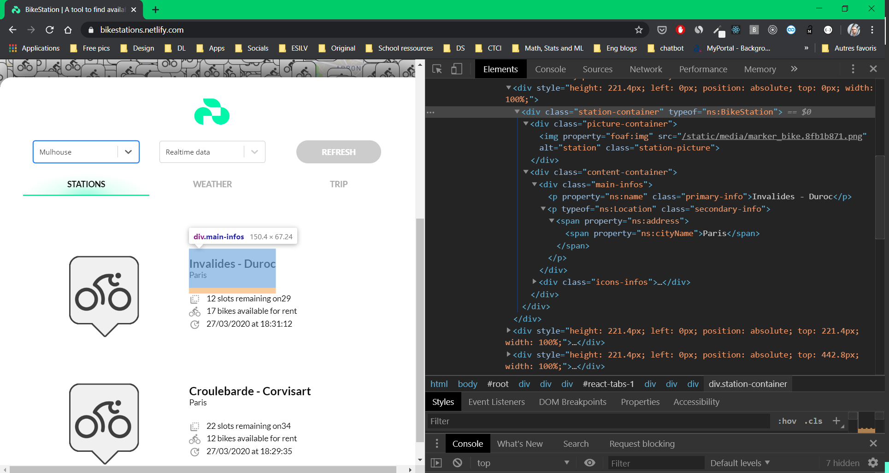
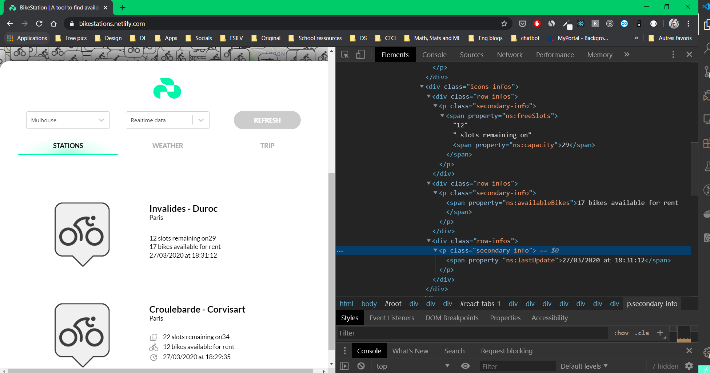
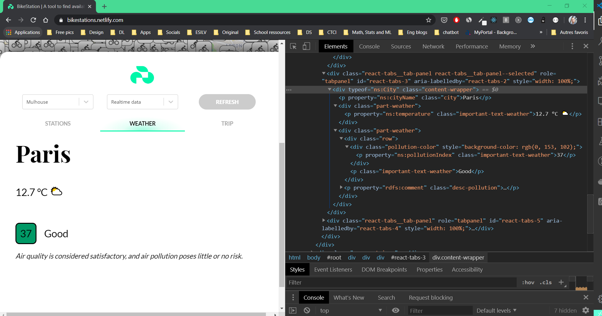

# 🚴🏻 **BikeStations**

A tool to visualize all the realtime availabilities of the bike stations of France, with weather and air quality data, and trip-planning.

_(Web Semantics final project)_

## Table of content

- 🎯 [Project Description and Requirements](#-project-requirements)
- 👀 [Project Demo](#-demo---how-to-use)
- 📝 [Installation Guide](#-how-to-install)
- 👨‍💻 [Used Technologies](#-used-technologies)
  1. Fuseki as TripleStore
  2. Flask with Python as backend API
  3. React as Frontend client
- ⚙️ [Application architecture](#%EF%B8%8F-application-architecture)
  1.  Data extraction
  2.  Data normalisation (JSON Mapping)
  3.  Triplestore
      - Ontology
      - Realtime store feeding
  4.  Querying the store (SPARQL)
      - Stations
      - Trips
      - etc
  5.  Real time data access
  6.  Geting trip
  7.  Frontend Client (React app)

## 🎯 Project requirements

**Make a Web application for finding available bicycles, using open data from the bicycle sharing systems of many cities.**

### Minimal requirements

· Setup a triplestore. The simplest is to use Apache Jena Fuseki, but you may also install a OpenLink's Virtuoso server (triplestore used by DBpedia in its backend) or Blazegraph (triplestore used by Wikidata) or Stardog (another commercial triplestore that has a free version). A list of triplestores is available on Wikipedia.

· Define or reuse a vocabulary for describing bicycle-sharing stations and their availability using Protégé.

· Convert static data about the bicycle stations into RDF, and load the resulting data to the triplestore. You can simply generate an RDF file that you load manually to the triplestore, or add the RDF programmatically using SPARQL Update queries.

· Make a website (or a GUI application) that will allow one to select a city (in a list or on a map) and get the availability of the bicycles, and bicycle stations. There resulting list should be available in HTML with RDFa. You may also make the data available in RDF (Turtle, RDF/XML, or JSON-LD) based on content negotiation.

· While the real time data may be generated on the fly, static data should be extracted from the triplestore using a SPARQL query.

### Additional requirements

· Provide other kinds of availabilities (make sure that you extend the vocabulary for this);

· Integrate other transportation data (find bike stations nearest to train station) or other geospatial data;

· Add information on the prices, street addresses, etc.;

· Store the history of availabilities, and provide statistics;

· Use weather or air quality data as well;

· Provide a trip planning functionality (go from Place 1 to Place 2 by taking the available bike closest to Place and bringing it to the station with available space, closest to Place 2).

## 👀 Demo - How to use

**The application is available from this url : https://bikestations.netlify.com/**

Its is composed in 2 parts:

- The menu on the left to interact with the different features
- A map on the right to show the results and explore.

Animated Demo:


RDFa examples for the town of Paris:

_(All the prefixes are defined in the html tag)_

The **list of stations** on the left, **the weather** and **air quality data** are _RDF-annotated_ as they are all part of our ontology:



Here we remove the _icons tags_ so that you can see all the interesting annotations:



Here is the **weather data**, RDF-annotated:



## 📝 How to install

You can test this project in local with **Docker** using the following steps :

1. First clone this repository

```
git clone https://github.com/alexZajac/BikeStations.git
```

2. Then **in the project folder** run the start script

```
start.sh
```

or if you are on Windows

```
start.bat
```

The project will then be available on http://DOCKER_IP_HOST url, which in most cases, will be http://localhost

## 👨‍💻 Used Technologies

### 1. Fuseki as TripleStore

#### Description

Apache Jena Fuseki is a SPARQL server. It can run as a operating system service, as a Java web application (WAR file), and as a standalone server. It provides security (using Apache Shiro) and has a user interface for server monitoring and administration.

#### How we use it

We choose to use it as a standalone server in order to just query the server with our SPARQL query and get the response containing the SPARQL query response.

### 2. Flask with Python as backend API

#### Description

Flask is a lightweight WSGI web application framework. It is designed to make getting started quick and easy, with the ability to scale up to complex applications. It began as a simple wrapper around Werkzeug and Jinja and has become one of the most popular Python web application frameworks.

#### How we use it

We use Flask to create a server running as a REST API. All the features of our final project are handled by this API that we can query from the frontend client. It fetches the differents city API's and normalize them with the help of our Ontology. The result is stored in the TripleStore (for static data) or just send back to the frontend client directly (for realtime data).

### 3. React as Frontend client

#### Description

React is a JavaScript library for building user interfaces. It is maintained by Facebook and a community of individual developers and companies.
React can be used as a base in the development of single-page or mobile applications.React is only concerned with rendering data to the DOM.

#### How we use it

We use React for all the frontend part. React only powers the user interface, interprets what the user wants to perform and calls our Python API.

## ⚙️ Application architecture

### 1. Data extraction

The data exctration is Handled by our Python API.

Since the data are spread in different data sources with different syntaxes, we fetch multiples urls for each city.

When the data is collected, we have to normalize it. Some data are in provided in JSON, others in XML. Also the properties names, global structures, or detailed properties are not the same for every source.

### 2. Data normalisation (JSON Mapping)

First, in order to normalize all the data, we convert the XML data into JSON data.

At this point we only have JSON data, but not with the same structure.

**We choose not to use a mapping using JSON-LD**

In order to process the mapping, we created our own mapping called `bikes_api.json`.
For each different JSON structure we have from the different data sources, we map it to our normalized reference structure.

Exemple for data for Lyon :

- We define the _datatype_ as _json_ to know how to process data.
- _pathToArray_ define the path to the array of station.
- _pathToData_ define the path inside the station object to extract our data.
- Inside _params_ we define all the data to extract and normalize. The value of those params refers to the path and the key to the right value. We can set a semicolomn to acces an array or object. For example we can write `coordinates;lng` to access the lng property of coordinates.

```json
  {
    "city": "Lyon",
    "url": [
      "https://download.data.grandlyon.com/wfs/rdata?..."
    ],
    "pathToArray": "features",
    "pathToData": "properties",
    "dataType": "json",
    "params": {
      "longitude": "lng",
      "latitude": "lat",
      "name": "name",
      "address": "address",
      "capacity": "bike_stands",
      "freeSlot": "available_bike_stands",
      "availableBikes": "available_bikes",
      "lastUpdate": "last_update"
    }
  },
```

Applying this to all our JSON strutures gives us all the data normalized in a homogeneous structure.

We use the same exact process that JSON-LD accomplishes, but with JSON. We chose to do it this way to facilitate the realtime data implementation. We think that converting JSON to JSON-LD to JSON to send it back to the client wasn't efficient.

### 3. TripleStore

#### Ontology

We created an ontology with protégé about cycling and stations.

It defines a vocabulary, types and properties we can use to query our feed and query our triplestore.

In order to use the ontology we exptorted it to an `.owl` file we can import.

#### Static store feeding

Based on the ontology and our normalized data, we create all the triplets that can define a station.

From the json format we create a series of triplets to define the stations, which define the station in RDF, and then we can import it in our Fuseki triplestore.

For realtime data in the triplestore, we just repeat these 3 steps in a loop-based process:

1. Data extraction
2. Data JSON normalization
3. JSON data conversion to RDF for adding it in the store

The user can update this database **anytime** by pressing a button in the frontend

### 4. Querying the store (SPARQL)

Having a triplestore using realtime data and our own vocubulary based on our ontology, we can query any data we want gathering every sources just by querying our triplet store in SPARQL.

The Python API receives requests with JSON body containing the city the user specified.

From the city we can build our SPARQL query to send to our triplestore :

```SPARQL
PREFIX rdf: <http://www.w3.org/1999/02/22-rdf-syntax-ns#>
PREFIX ns: <http://www.owl-ontologies.com/unnamed.owl#>

SELECT DISTINCT ?s ?ca ?fr ?av ?last ?l ?city ?name ?addr ?lat ?long
WHERE {
        ?s rdf:type ns:BikeStation .
        ?s ns:capacity ?ca .
        ?s ns:freeSlots ?fr .
        ?s ns:availableBikes ?av .
        ?s ns:lastUpdate ?last .
        ?s ns:location ?l .
        ?l ns:name ?name .
        ?l ns:address ?addr .
        ?l ns:lat ?lat .
        ?l ns:long ?long .
        ?l ns:city ?c .
        ?c ns:cityName "{city}" .
        ?c ns:cityName ?city .
}
```

> In this query the {city} is replaced by the city the user specified.

With all the information we get from the SPARQL query response we build our API response to send it back to the frontend client.

API response format:

```json
{
    "data":{
        "city": "Lyon",
        "stations": [
            {
                "_id" : "BikeStation_1",
                "city": "Lyon",
                "name": "Perrache Est",
                "address": "48 Cours Suchet",
                "latitude": 34.052234,
                "longitude": -118.243685,
                "capacity": 20,
                "freeSlot": 3,
                "availableBikes": 17,
                "lastUpdate": "2020-03-20 10:30:00"
            },
            ...
        ]
    }
}
```

### 5. Real time data access

To get real-time data to the front end, we simply execute the following steps:

1. Data extraction
2. Data JSON normalization
3. Send back data to the frontend

### 6. Getting a trip

To get a trip between two locations, we only need the **starting** and **ending** address.

We convert those starting and ending address into coordinates with the **Geocoding API** from Google Maps.

Then we find the **nearest city** from the starting/ending locations and we query station data from that city.

From all theses stations we find and return the nearest available bike station from the differents locations.

But, we take into account the fact that the starting station **must have available bikes** and the ending station **must have an available slot** for that bike.

### 7. Frontend Client

Our front end is entierely with **React v16** and is simply the User Interface.

This is where the user can select fonctionnalities. The demand will be send to the Python API server, that will return the response like explained above.

Then it displays the results into the both parts:

- The stations and their coordinates on the **map interface**.
- The interesting infos about the stations on the left, along with the **weather and air quality data**, and the **trip functionnality**.
